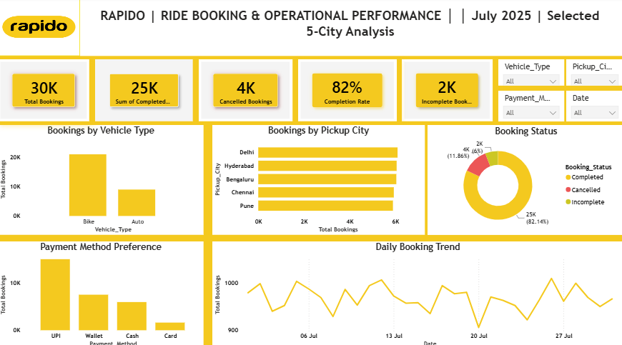
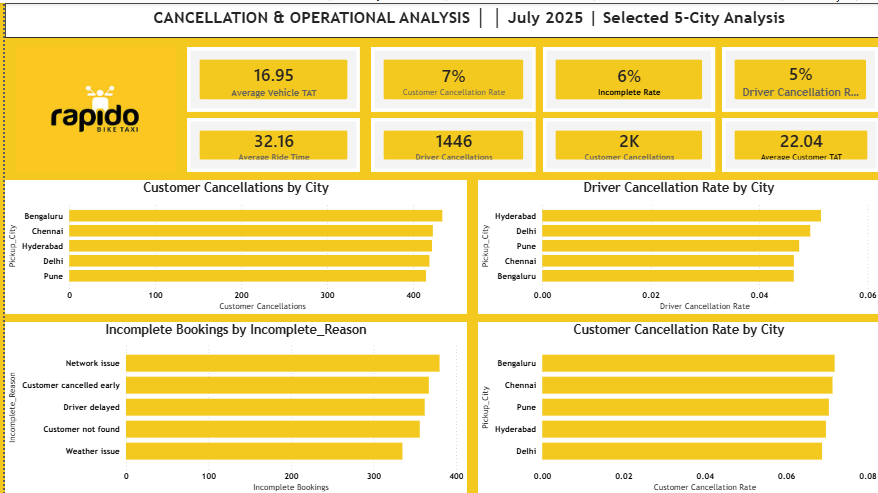

# 🏍️ Rapido | Ride Booking & Operational Performance Analysis

**Power BI | 30,000+ Ride Bookings | 5-City Analysis | July 2025**

An end-to-end Power BI analytics project analyzing ride booking volume, completion performance, and cancellation/operational drivers across Rapido's five largest cities — Delhi, Hyderabad, Bengaluru, Chennai, and Pune.

---

## 📌 Project Overview

Rapido (bike-taxi/ride-hailing platform) generates high booking volumes daily, but leadership lacked a consolidated view connecting **booking performance** to **root causes of failed rides**. This project builds a two-dashboard Power BI system that gives executives a performance snapshot and gives operations teams a diagnostic drill-down — so both "what happened" and "why it happened" are answered from the same dataset.

| | |
|---|---|
| **Tool** | Power BI Desktop |
| **Period Analyzed** | July 2025 |
| **Scope** | 5 cities — Delhi, Hyderabad, Bengaluru, Chennai, Pune |
| **Volume** | 30,000+ ride bookings |
| **Deliverables** | 2 interactive dashboards, BRD, data model |

---

## 🎯 Business Problem

Operations and city teams needed answers to:
1. What's our overall booking completion rate, and how is it trending daily?
2. Which cities, vehicle types, and payment methods drive the most volume?
3. Where are we losing rides — customer cancellations, driver cancellations, or incomplete/failed trips?
4. What are the root causes behind incomplete bookings (network issues, no-shows, delays, weather)?
5. How does cancellation behavior differ **by city** and **by who cancels** (customer vs. driver)?

---

## 📊 Dashboard 1 — Ride Booking & Operational Performance (Executive View)



**Purpose:** A single-page executive snapshot of overall booking health.

**Key KPIs:**
- Total Bookings: **30K**
- Completed Bookings: **25K**
- Cancelled Bookings: **4K**
- Completion Rate: **82%**
- Incomplete Bookings: **2K**

**Visuals:**
- Bookings by Vehicle Type (Bike vs. Auto)
- Bookings by Pickup City (Delhi, Hyderabad, Bengaluru, Chennai, Pune)
- Booking Status breakdown (Completed / Cancelled / Incomplete)
- Payment Method Preference (UPI, Wallet, Cash, Card)
- Daily Booking Trend across July 2025
- Slicers: Vehicle Type, Pickup City, Payment Method, Date

**Key Insight:** UPI is the dominant payment method (~50%+ share) and Bike is the leading vehicle type by volume — both signal where partnership and operational investment should be prioritized.

---

## 🛠️ Dashboard 2 — Cancellation & Operational Analysis (Diagnostic View)



**Purpose:** A drill-down into *why* bookings fail, built for ops and city managers.

**Key KPIs:**
- Average Vehicle TAT: **16.95 min**
- Customer Cancellation Rate: **7%**
- Incomplete Rate: **6%**
- Driver Cancellation Rate: **5%**
- Average Ride Time: **32.16 min**
- Driver Cancellations: **1,446**
- Customer Cancellations: **2K**
- Average Customer TAT: **22.04 min**

**Visuals:**
- Customer Cancellations by City
- Driver Cancellation Rate by City
- Incomplete Bookings by Reason (Network issue, Customer cancelled early, Driver delayed, Customer not found, Weather issue)
- Customer Cancellation Rate by City

**Key Insight:** Bengaluru and Chennai show the highest customer cancellation rates, while "Network issue" and "Driver delayed" are the leading causes of incomplete bookings — pointing to connectivity and driver-allocation improvements as the highest-leverage fixes.

---

## 🧩 Data Model & Metrics

| Metric | Definition |
|---|---|
| Completion Rate | Completed Bookings ÷ Total Bookings |
| Customer Cancellation Rate | Customer-Cancelled Bookings ÷ Total Bookings |
| Driver Cancellation Rate | Driver-Cancelled Bookings ÷ Total Bookings |
| Incomplete Rate | Incomplete Bookings ÷ Total Bookings |
| Vehicle TAT | Turnaround time between booking and vehicle assignment/arrival |
| Ride Time | Duration of the ride from pickup to drop |

Core fields in the dataset: `Booking_ID`, `Pickup_City`, `Vehicle_Type`, `Payment_Method`, `Booking_Status`, `Incomplete_Reason`, `Booking_Date`, `Vehicle_TAT`, `Ride_Time`, `Customer_TAT`.

---

## 🔍 Key Business Takeaways

1. **82% completion rate** across 30K bookings — solid, but the remaining 18% (cancellations + incompletes) represents real revenue leakage worth ~5,400 lost rides in a single month across 5 cities.
2. **Customer cancellations (7%) outpace driver cancellations (5%)** — suggesting demand-side friction (long ETAs, price changes) may need as much attention as supply-side (driver) issues.
3. **Network issues and driver delays are the top two incomplete-booking reasons** — both are addressable through infrastructure/dispatch improvements rather than pricing or marketing levers.
4. **UPI dominance and Bike-led volume** confirm the platform's core users are price-sensitive, mobile-first commuters — useful for future partnership and incentive design.
5. **City-level variance in cancellation behavior** (e.g., Bengaluru/Chennai higher) means a one-size-fits-all operational fix likely under-performs a city-specific rollout.

---

## 📁 Repository Structure

```
rapido-ride-booking-analysis/
│
├── README.md                          # Project overview (this file)
├── docs/
│   └── BRD_Rapido_Ride_Booking_Analysis.docx   # Business Requirements Document
├── assets/
│   └── screenshots/
│       ├── 01_booking_performance_dashboard.png
│       └── 02_cancellation_operations_dashboard.png
├── data/
│   └── (raw/sample dataset )
└── pbix/
    Rapido_Behaviour_Analysis.pbix
```


## 🧰 Tools & Skills Used

`Power BI Desktop` · `DAX` · `Power Query (data cleaning & transformation)` · `Data Modeling` · `Dashboard Design` · `Business Requirement Documentation`

---

## 👤 Author

Feel free to connect if you'd like to discuss the project, the dataset, or Power BI in general.

Linkedin[https://www.linkedin.com/in/saraswati-shinde/]
